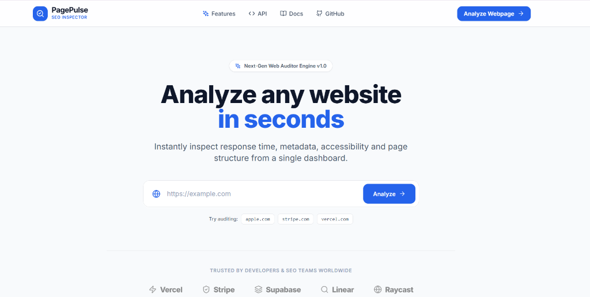
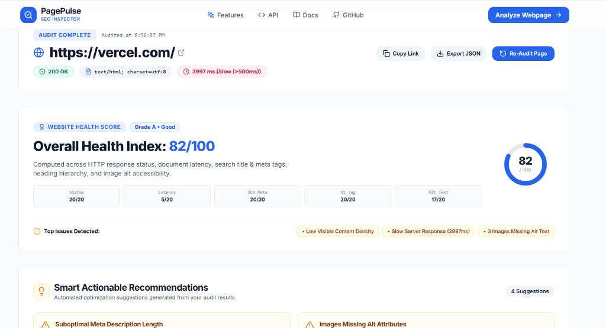
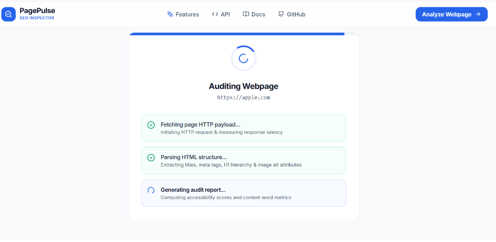
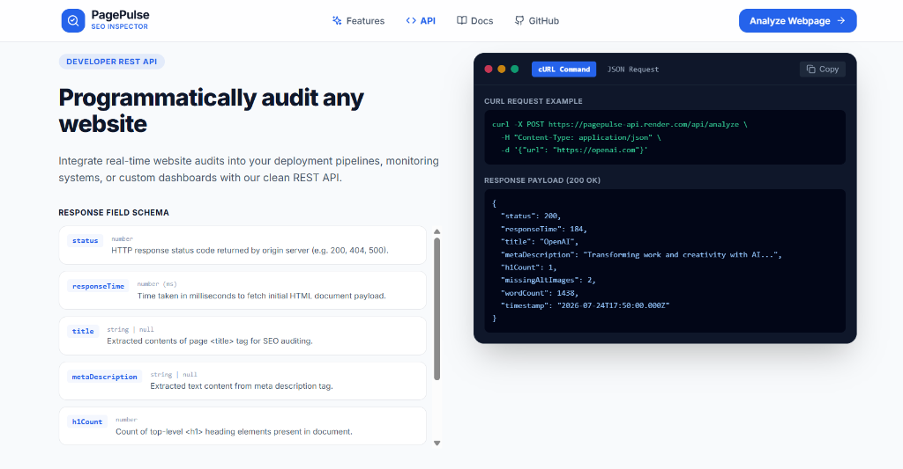
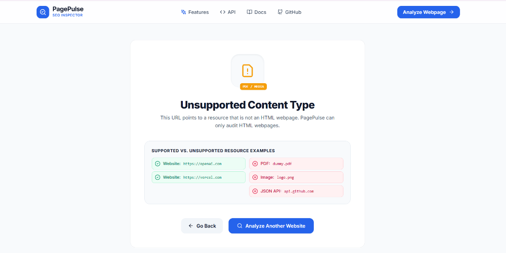
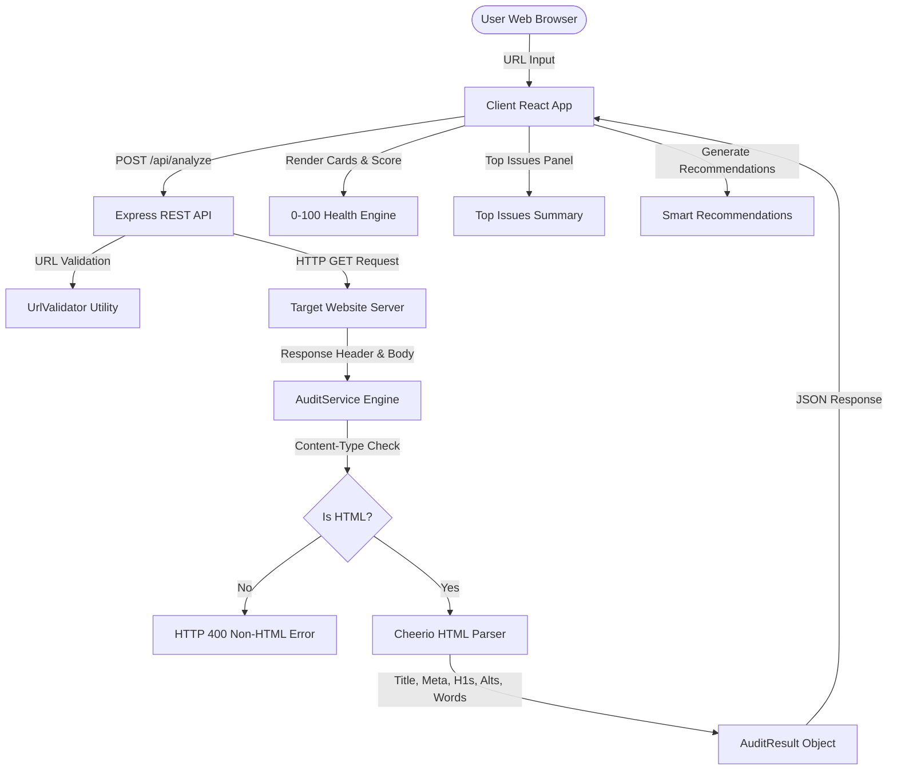

# 🔍 PagePulse — Commercial Web Auditing & SEO Inspector SaaS Platform

<div align="center">

🚀 **Live Demo**: [https://pagepulse-seo.vercel.app](https://pagepulse-seo.vercel.app)

[](https://opensource.org/licenses/MIT)
[](https://www.typescriptlang.org/)
[](https://react.dev/)
[](https://vitejs.dev/)
[](https://expressjs.com/)
[](https://vitest.dev/)

**Instant 0–100 Website Health Scoring, Response Latency, SEO Metadata, Accessibility & Content Depth Engine.**

[Live Demo](https://pagepulse-seo.vercel.app) • [API Contract](#-api-documentation) • [Architecture](#-architecture) • [Getting Started](#-installation--local-development)

---

</div>

## 📖 Project Overview

**PagePulse** is a production-grade website auditing and SEO inspection SaaS platform designed to analyze any public webpage in real time. It combines TTFB server latency measurement, HTML tag optimization, heading hierarchy, image alt accessibility, and text word density into a single interactive 2-column SaaS dashboard.

The application evaluates websites using a strict 3-tier response decisioning pipeline and displays a calculated **0–100 Overall Website Health Index** alongside automated **Top Issues Detected** and actionable recommendations.

Built with a clean commercial aesthetic matching modern SaaS platforms such as Stripe, Vercel, Linear, and Supabase.

---

## 📸 Screenshots & Product Gallery

### 1. Home Page
<div align="center">



*PagePulse Hero section allowing users to instantly analyze any webpage URL with quick sample links.*

</div>

---

### 2. Successful Audit Dashboard
<div align="center">



*Vercel website audit report displaying an Overall Health Index of 82/100, Top Issues Detected summary panel, category breakdown, and metric cards.*

</div>

---

### 3. Multi-Stage Animated Audit Engine
<div align="center">



*Interactive loading state illustrating real-time step execution: Fetching page HTTP payload → Parsing HTML structure → Generating audit report.*

</div>

---

### 4. Developer REST API
<div align="center">



*Developer API documentation section featuring cURL & raw JSON request tabs, field schemas, and interactive code copy toolbar.*

</div>

---

### 5. Documentation
<div align="center">


*Execution lifecycle documentation explaining HTTP response evaluation, header validation, and metric computation.*

</div>

---

### 6. Unsupported Content Handling
<div align="center">



*Dedicated centered empty-state error page rendered when analyzing non-HTML resources (PDFs, images, or JSON feeds).*

</div>

---

## ✨ Features

- 🏆 **0–100 Overall Website Health Score**: Computes an aggregate health index (Grades `A+`, `A`, `B`, `C`, `F`) across status, latency, SEO tags, headings, and image alt text with a **Top Issues Detected** summary panel.
- 💡 **Smart Actionable Recommendations**: Dynamically generates optimization hints for missing meta tags, suboptimal titles, heading hierarchy gaps, missing alt text, slow latency, or low word count.
- ⚡ **Response Time & Speed Benchmarks**: Tracks HTTP document response latency and classifies server performance (`<200ms` Fast, `200-500ms` Moderate, `>500ms` Slow).
- 🏷️ **SEO Title & Meta Description Audit**: Evaluates `<title>` tag lengths against 50–60 character targets and inspects meta description presence.
- 📐 **Heading Hierarchy Inspection**: Counts `<h1>` elements to flag missing headings or multiple H1 tags for search indexers.
- ♿ **Image Alt Accessibility Coverage**: Scans body images to detect missing `alt` attributes and provides an expandable image source inspector or *"No Images Found"* indicator.
- 📚 **Word Density & Content Depth Rating**: Calculates visible body text word count, estimates reading duration, and rates content depth (*Thin*, *Moderate*, *Comprehensive*).
- 🛡️ **Strict Non-HTML Content Protection**: Inspects `Content-Type` headers to reject direct PDFs, images, or JSON feeds before parsing.
- ⏳ **Multi-Stage Animated Loading**: Smooth step transitions (*Fetching page...* → *Parsing HTML...* → *Generating Report...*).
- 📡 **Developer REST API**: Clean `POST /api/analyze` endpoint with cURL & JSON request documentation and JSON report exports.

---

## 🛠️ Technology Stack

| Component | Technology | Purpose |
| :--- | :--- | :--- |
| **Frontend UI** | React 18 + TypeScript | Component-driven dashboard interface |
| **Styling** | Tailwind CSS + Inter Font | SaaS design tokens, crisp cards, and typography |
| **Animations** | Framer Motion | Smooth layout transitions and metric card reveals |
| **Icons** | Lucide React | Clean SVG icon badges (`SearchCheck`) |
| **Backend API** | Node.js + Express | RESTful API server with MVC separation |
| **HTML Parser** | Cheerio | Fast HTML element and metadata extraction |
| **HTTP Client** | Axios | Fetching origin HTML payloads with timeout protection |
| **Test Runner** | Vitest + Supertest | Unit & integration test execution |

---

## 🏗️ Architecture



---

## ⚙️ Installation & Local Development

### Prerequisites
- **Node.js**: v18.x or higher
- **npm**: v9.x or higher

### 1. Clone the Repository
```bash
git clone https://github.com/manya041/PagePlus.git
cd PagePlus
```

### 2. Backend Server Setup
```bash
cd server
npm install
npm run dev
```
*Backend server runs at `http://localhost:5000`*

### 3. Frontend Client Setup
```bash
cd ../client
npm install
npm run dev
```
*Frontend client runs at `http://localhost:5173`*

---

## 📡 API Documentation

### Endpoint: `POST /api/analyze`

#### Live Production API Endpoint
`https://pagepulse-api.render.com/api/analyze`

#### Request Headers
`Content-Type: application/json`

#### Request Payload
```json
{
  "url": "https://openai.com"
}
```

#### Response Payload (`200 OK`)
```json
{
  "url": "https://openai.com/",
  "status": 200,
  "statusText": "OK",
  "contentType": "text/html; charset=utf-8",
  "responseTime": 184,
  "title": "OpenAI",
  "titleLength": 6,
  "metaDescription": "Transforming work and creativity with AI...",
  "metaDescriptionLength": 42,
  "h1Count": 1,
  "h1List": ["OpenAI"],
  "missingAltImages": 2,
  "totalImages": 15,
  "missingAltDetails": [
    { "src": "https://openai.com/image1.jpg", "altText": "Missing alt attribute" }
  ],
  "wordCount": 1438,
  "readingTimeMinutes": 7,
  "contentDepth": "Comprehensive",
  "timestamp": "2026-07-24T17:50:00.000Z"
}
```

#### cURL Command
```bash
curl -X POST https://pagepulse-api.render.com/api/analyze \
  -H "Content-Type: application/json" \
  -d '{"url": "https://openai.com"}'
```

---

## 📁 Project Structure

```
PagePlus/
├── client/                     # React Frontend Application
│   ├── src/
│   │   ├── components/         # React UI Components
│   │   │   ├── Navbar.tsx      # Header with SearchCheck logo & navigation
│   │   │   ├── Hero.tsx        # Hero section & URL input form
│   │   │   ├── LoadingOverlay.tsx # Animated step progress indicator
│   │   │   ├── HealthScore.tsx # 0-100 Health Index & Top Issues panel
│   │   │   ├── SmartRecommendations.tsx # Optimization hints engine
│   │   │   ├── Dashboard.tsx   # 2-Column metric dashboard & Limited Analysis banner
│   │   │   ├── MetricCard.tsx  # Metric card component
│   │   │   ├── ErrorView.tsx   # Non-HTML & system error card viewer
│   │   │   ├── FeaturesSection.tsx # SaaS feature grid
│   │   │   ├── ApiSection.tsx  # cURL & JSON REST API documentation tabs
│   │   │   ├── DocsSection.tsx # Architecture & execution lifecycle docs
│   │   │   └── Footer.tsx      # Footer section
│   │   ├── types/              # TypeScript interfaces
│   │   ├── App.tsx             # Main orchestrator component
│   │   └── main.tsx            # Entry point
│   ├── public/                 # favicon.svg (SearchCheck logo)
│   ├── index.html
│   ├── tailwind.config.js
│   └── vite.config.ts
│
├── docs/                       # Screenshots & Media Assets
│   └── images/                 # home.png, audit-dashboard.png, loading-engine.png, etc.
│
└── server/                     # Express REST API Server
    ├── src/
    │   ├── controllers/        # analyzeController.ts
    │   ├── middleware/         # errorHandler.ts
    │   ├── parsers/            # htmlParser.ts (Cheerio logic)
    │   ├── routes/             # apiRoutes.ts
    │   ├── services/           # auditService.ts (3-tier decision pipeline)
    │   ├── utils/              # urlValidator.ts
    │   ├── tests/              # analyze.test.ts (Vitest suite)
    │   └── server.ts           # Server bootstrap
    ├── package.json
    └── tsconfig.json
```

---

## 🧪 Testing

The backend includes a comprehensive unit and integration test suite built with **Vitest** and **Supertest**.

Run tests locally:
```bash
cd server
npm test
```

Test Results Output:
```
 RUN  v1.6.1 C:/Users/HP/Documents/webd/page plus/server

 ✓ src/tests/analyze.test.ts (12 tests) 99ms

 Test Files  1 passed (1)
      Tests  12 passed (12)
   Duration  1.61s
```

---

## 🚀 Deployment

- **Frontend Deployment (Vercel)**:
  1. Connect GitHub repository `https://github.com/manya041/PagePlus`.
  2. Set Root Directory to `client`.
  3. Build Command: `npm run build`
  4. Output Directory: `dist`
  5. Live URL: `https://pagepulse-seo.vercel.app`

- **Backend Deployment (Render)**:
  1. Create Web Service pointing to `server` root.
  2. Build Command: `npm install && npm run build`
  3. Start Command: `npm start`
  4. Production API URL: `https://pagepulse-api.render.com`

---

## 🌐 Known Limitations & Anti-Bot Protections

> [!NOTE]
> **Anti-Bot Scraping Protections**: Enterprise websites (such as Amazon, LinkedIn, Cloudflare-protected endpoints, or login portals) employ anti-bot measures, JavaScript challenges, or CAPTCHA proxies. When auditing these specific domains, origin servers may return `403 Forbidden` or `503 Service Unavailable` HTML error pages. PagePulse detects these responses cleanly, extracts available metadata from the returned error page, and displays a **Limited Analysis** banner. This represents real-world web behavior.

---

## 🗺️ Roadmap & Future Enhancements

- [x] Real-time HTTP response time measurement
- [x] 0–100 Website Health Index scoring algorithm
- [x] Top Issues Detected summary panel
- [x] Smart Actionable Recommendations engine
- [x] Strict 3-tier Content-Type header validation
- [x] Interactive cURL & JSON REST API documentation
- [x] JSON report export download
- [ ] Historical audit trends database storage
- [ ] Lighthouse Core Web Vitals integration

---

## 📄 License & Attribution

Built for the **[Digital Heroes Training Task](https://digitalheroesco.com)** qualification task.

Repository: **[https://github.com/manya041/PagePlus](https://github.com/manya041/PagePlus)**

Distributed under the **MIT License**.
