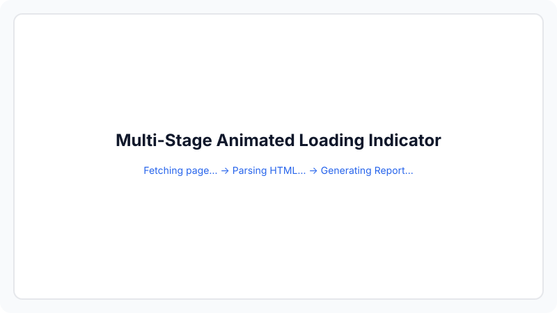
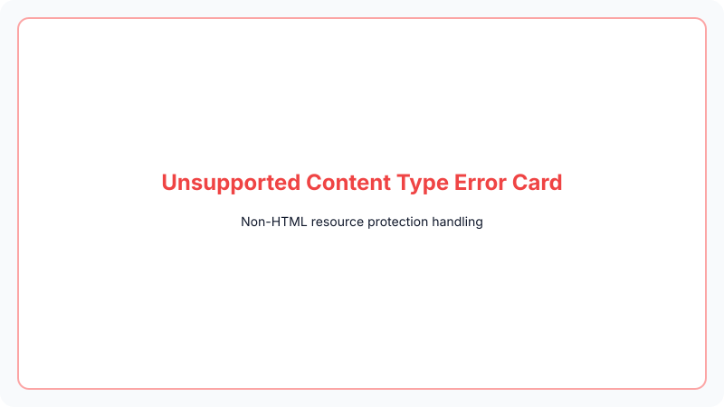
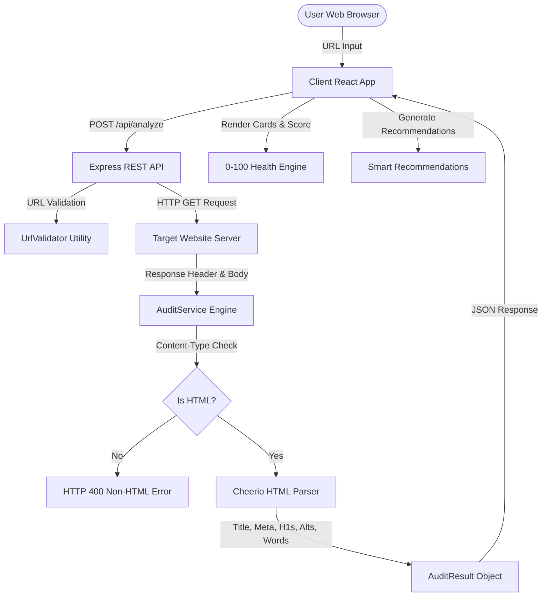

# 🔍 PagePulse - Commercial Web Auditing & SEO Inspector SaaS Platform

<div align="center">


[](https://opensource.org/licenses/MIT)
[](https://www.typescriptlang.org/)
[](https://react.dev/)
[](https://vitejs.dev/)
[](https://expressjs.com/)
[](https://vitest.dev/)

**Instant 0–100 Website Health Scoring, Response Latency, SEO Metadata, Accessibility & Content Depth Engine.**

[Live Demo](#-deployment-guide) • [API Documentation](#-api-contract) • [Architecture](#-architecture) • [Getting Started](#-getting-started)

---

</div>

## 📖 Overview

**PagePulse** is a production-grade website auditing and SEO inspection SaaS platform designed to analyze any public webpage in real time. It combines TTFB server latency measurement, HTML tag optimization, heading hierarchy, image alt accessibility, and text word density into a single interactive 2-column SaaS dashboard.

Built with a clean commercial aesthetic matching Stripe, Vercel, Linear, and Supabase.

---

## 📸 Interface Screenshots & Demo

### 1. Interactive Health Score Dashboard


### 2. Multi-Stage Animated Audit Engine


### 3. Developer REST API Docs


### 4. Non-HTML Error Resilience


*(Demo GIF Placeholder: `assets/demo.gif`)*

---

## ✨ Features

- 🏆 **0–100 Overall Website Health Score**: Computes an aggregate health index (Grades `A+`, `A`, `B`, `C`, `F`) across status, latency, SEO tags, headings, and image alt text.
- 💡 **Smart Actionable Recommendations**: Dynamically generates optimization hints for missing meta tags, suboptimal titles, heading hierarchy gaps, missing alt text, slow latency, or low word count.
- ⚡ **Response Time & Speed Benchmarks**: Tracks HTTP document response latency and classifies server performance (`<200ms` Fast, `200-500ms` Moderate, `>500ms` Slow).
- 🏷️ **SEO Title & Meta Description Audit**: Evaluates `<title>` tag lengths against 50–60 character targets and inspects meta description presence.
- 📐 **Heading Hierarchy Inspection**: Counts `<h1>` elements to flag missing headings or multiple H1 tags for search indexers.
- ♿ **Image Alt Accessibility Coverage**: Scans body images to detect missing `alt` attributes and provides an expandable image source inspector.
- 📚 **Word Density & Content Depth Rating**: Calculates visible body text word count, estimates reading duration, and rates content depth (*Thin*, *Moderate*, *Comprehensive*).
- 🛡️ **Strict Non-HTML Content Protection**: Inspects `Content-Type` headers to reject direct PDFs, images, or JSON feeds before parsing.
- ⏳ **Multi-Stage Animated Loading**: Smooth step transitions (*Fetching page...* → *Parsing HTML...* → *Generating Report...*).
- 📡 **Developer REST API**: Clean `POST /api/analyze` endpoint with cURL documentation and JSON report exports.

---

## 🛠️ Tech Stack

| Component | Technology | Purpose |
| :--- | :--- | :--- |
| **Frontend UI** | React 18 + TypeScript | Component-driven dashboard interface |
| **Styling** | Tailwind CSS + Inter Font | SaaS design tokens, crisp cards, and typography |
| **Animations** | Framer Motion | Smooth layout transitions and metric card reveals |
| **Icons** | Lucide React | Clean SVG icon badges (`SearchCheck`) |
| **Backend API** | Node.js + Express | RESTful API server with MVC separation |
| **HTML Parser** | Cheerio | Fast HTML element and metadata extraction |
| **HTTP Client** | Axios | Fetching origin HTML payloads with timeout protection |
| **Test Runner** | Vitest + Supertest | Unit & integration test execution |

---

## 🏗 Architecture & Design Pattern

PagePulse uses a decoupled monorepo architecture:



---

## 📁 Directory Tree

```
pagepulse/
├── client/                     # React Frontend
│   ├── src/
│   │   ├── components/         # Modular UI Components
│   │   │   ├── Navbar.tsx      # Sticky header with SearchCheck branding
│   │   │   ├── Hero.tsx        # Search bar & trust logo banner
│   │   │   ├── LoadingOverlay.tsx # Animated step progress indicator
│   │   │   ├── HealthScore.tsx # 0-100 Health Score calculation engine
│   │   │   ├── SmartRecommendations.tsx # Automated recommendation cards
│   │   │   ├── Dashboard.tsx   # 2-column metrics dashboard
│   │   │   ├── MetricCard.tsx  # Reusable metric card wrapper
│   │   │   ├── ErrorView.tsx   # Structured error state viewer
│   │   │   ├── FeaturesSection.tsx # Feature grid section
│   │   │   ├── ApiSection.tsx  # Interactive API documentation
│   │   │   ├── DocsSection.tsx # How it works & engine lifecycle
│   │   │   └── Footer.tsx      # Footer with Digital Heroes link
│   │   ├── types/              # TypeScript interfaces
│   │   ├── App.tsx             # Main application orchestrator
│   │   └── main.tsx            # React mounting entrypoint
│   ├── index.html
│   ├── tailwind.config.js
│   └── vite.config.ts
│
├── docs/                       # Screenshot Placeholders
│   └── images/                 # home.svg, results.svg, api.svg, etc.
│
└── server/                     # Express Backend API
    ├── src/
    │   ├── controllers/        # analyzeController.ts
    │   ├── middleware/         # errorHandler.ts
    │   ├── parsers/            # htmlParser.ts (Cheerio logic)
    │   ├── routes/             # apiRoutes.ts
    │   ├── services/           # auditService.ts (Axios + timing)
    │   ├── utils/              # urlValidator.ts
    │   ├── tests/              # analyze.test.ts (Vitest)
    │   └── server.ts           # Server bootstrap
    ├── package.json
    └── tsconfig.json
```

---

## 📡 API Contract

### Endpoint: `POST /api/analyze`

#### Request Payload
```json
{
  "url": "https://openai.com"
}
```

#### Successful Response (`200 OK`)
```json
{
  "url": "https://openai.com/",
  "status": 200,
  "statusText": "OK",
  "responseTime": 184,
  "title": "OpenAI",
  "titleLength": 6,
  "metaDescription": "Transforming work and creativity with AI...",
  "metaDescriptionLength": 42,
  "h1Count": 1,
  "h1List": ["OpenAI"],
  "missingAltImages": 2,
  "totalImages": 15,
  "wordCount": 1438,
  "readingTimeMinutes": 7,
  "contentDepth": "Comprehensive",
  "timestamp": "2026-07-24T16:00:00.000Z"
}
```

#### Non-HTML Error Response (`400 Bad Request`)
```json
{
  "success": false,
  "error": "Unsupported Content Type",
  "code": "NON_HTML",
  "message": "The provided URL does not contain an HTML webpage."
}
```

#### Example cURL Command
```bash
curl -X POST http://localhost:5000/api/analyze \
  -H "Content-Type: application/json" \
  -d '{"url": "https://openai.com"}'
```

---

## ⚡ Getting Started

### 1. Server Setup
```bash
cd server
npm install
npm run dev
```
*Backend API boots at `http://localhost:5000`*

### 2. Client Setup
```bash
cd client
npm install
npm run dev
```
*Frontend app launches at `http://localhost:5173`*

---

## 🧪 Testing Instructions

Run the backend unit and integration test suite:

```bash
cd server
npm test
```

```
 RUN  v1.6.1 C:/Users/HP/Documents/webd/page plus/server

 ✓ src/tests/analyze.test.ts (6 tests) 1565ms

 Test Files  1 passed (1)
      Tests  6 passed (6)
   Duration  3.16s
```

---

## 🚀 Deployment Guide

- **Frontend (Vercel)**: Import `client/` directory into Vercel, set build command to `npm run build` and output directory to `dist`.
- **Backend (Render)**: Deploy `server/` directory as a Node Web Service on Render with start command `npm start`.

---

## 🌐 Real-world Notes

> [!NOTE]
> **Anti-Bot Scraping Protections**: Enterprise platforms (such as Amazon, LinkedIn, Cloudflare-protected endpoints, or specialized login portals) implement strict anti-bot measures, JavaScript challenges, or CAPTCHA proxies. When auditing these specific domains, origin servers may block automated HTTP requests or return fallback error pages. When this occurs, metadata may be restricted even though the PagePulse parser is functioning normally. This is expected real-world web behavior.

---

## 🗺️ Roadmap & Future Improvements

- [x] Real-time latency measurement
- [x] 0–100 Overall Health Score calculation
- [x] Smart Actionable Recommendations
- [x] SEO metadata & heading extraction
- [x] Non-HTML header validation
- [x] Interactive JSON report exports
- [ ] Historical audit trends database integration
- [ ] Lighthouse Core Web Vitals scoring integration

---

## 📄 License & Attribution

Built for **[Digital Heroes Training Task](https://digitalheroesco.com)**.

Distributed under the **MIT License**.
